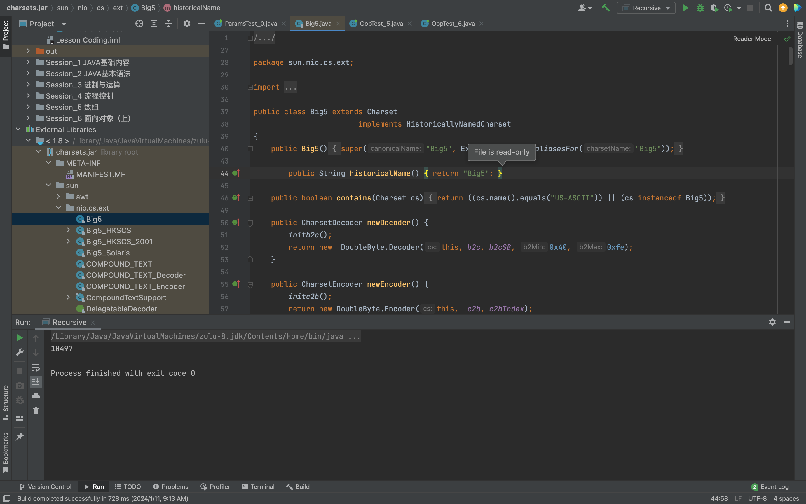

<h1>对java包相关内容的理解（代码外的文件层理解）</h1>
<h2>包名的命名规范</h2>

例如，如果一个公司的网站域名为www.example.com，那么该公司的Java包命名可以采用com.example作为前缀，例如com.example.project、com.example.util等。<br/>
这种命名规范的好处是，无论在哪个项目或模块中，只要看到包名，就可以快速地识别出该代码属于哪个公司或组织，以及其所属的项目或模块。这有助于提高代码的可读性和可维护性。<br/>

<h2>jar包的理解</h2>
Java生成的JAR文件（Java Archive）通常包含编译后的.class文件。这些.class文件是Java源代码经过编译后的字节码文件。<br/>
当在Java项目中编译源代码时，编译器（例如javac）将源代码转换为字节码，并保存在.class文件中。然后，可以将这些.class文件打包到一个或多个JAR文件中。<br/>
一个JAR文件本质上是一个ZIP文件，它使用特定的目录结构来组织内部的文件。在一个标准的JAR文件中，通常会找到一个META-INF目录，其中包含有关JAR文件的元数据（例如MANIFEST.MF文件），以及一个或多个包含.class文件的目录。<br/>
要创建JAR文件，可以使用jar命令行工具，该工具是Java Development Kit (JDK) 的一部分。例如，要创建一个名为myapp.jar的JAR文件，你可以使用以下命令：<br/>

```
jar cvf myapp.jar com/
```
这将创建一个名为myapp.jar的JAR文件，并将com/目录下的所有.class文件添加到其中。<br/>

<h2>.MF文件的说明</h2>
可以将MF文件理解为JDK运行JAR包的说明书，由于.MF文件的存在，JDK才可以直接运行JAR包。<br/>
在运行时，JDK会解析.MF文件中的信息，并根据其中的配置来加载和执行相应的类。这样，用户可以直接双击JAR包来运行程序，或者使用命令行工具来启动JAR包，而不需要手动解压和配置环境变量等操作。<br/>
.MF文件是JAR包的清单文件，用于描述JAR包的各种属性和配置。.MF文件包含了用于运行JAR包所需的各种元数据，例如入口点（Main-Class）和类路径（Class-Path）等。<br/>
入口点（Main-Class）指定了程序的入口，即包含main()方法的类。通过指定入口点，可以直接使用java -jar命令来运行JAR包。<br/>
类路径（Class-Path）用于指定JAR包的依赖关系。它告诉Java虚拟机在哪里可以找到JAR包所依赖的其他库或资源。<br/>

<h2>关于ide调用其他jar包的理解</h2>
原则上写有原始代码的.java文件经过编译后，生辰的.class文件为二进制文件，人类是无法直接读懂的。但是部分IDE存在反编译功能（比如intellij），可以讲二进制.class文件反编译成人类能看懂的源代码，反射到前端供人查看。</br>



可以看到ide可以对引用到的JAR包（.class文件）进行反向编译，并显示编译之前的源代码。但是从图上也能看到，虽然能显示源代码但是并不能修改（图中显示Read Only） <br/>

<h1>package关键字相关内容</h1>
一个.java源文件最多只能归属一个包（package）且package语句必须在源文件的第一条非注释性语句，也就是说一个源文件中只能包含一句package语句。 <br/>
包与包下面的子包----

<h1>import关键字相关内容</h1>
<h2>import</h2>
通过import关键字，可以将其他Java类导入到当前文件中，这样就可以在当前文件中直接使用这些类，而不需要每次都写出完整的类名。例如，如果要使用java.util包中的ArrayList类，可以使用import关键字将其导入到当前文件中，然后可以直接使用ArrayList类。<br/>
！！！【不能用import的情况】两个子包中有名字相同的类！！！<br/>

<h2>import static</h2>
静态导入：当想使用某个类的静态成员（如静态变量、静态方法）时，而该类的名字很长或者你频繁地使用这个类的静态成员，可以使用静态导入来简化代码。例如，可以这样导入 java.lang.Math 类中的静态方法：import static java.lang.Math.*;，然后直接使用 sqrt()、max() 等方法，而不需要每次都写出完整的类名。<br/>
<br/>
导入所有静态成员：使用 * 通配符可以导入一个类中的所有静态成员。例如，import static java.lang.Math.*; 将会导入 Math 类中的所有静态方法，如 sqrt()、max() 等。
总的来说，import static 主要是为了简化代码和提高代码的可读性。它允许你直接使用静态成员，而不需要每次都写出完整的类名。<br/>

<h2>import与import static区别理解</h2>
！！！【个人理解】import static大部分用于调用抽象类（对比实体类，比如Person类）比如Math类的各种方法。！！！ <br/>
import引入的是“类名”，在代码中引用时写的是【类名.类成员名称】；import static引入的是“类的静态成员名”，在代码中引用时可以直接写【静态成员名称】。总的来说两种引入都是为了减少代码量<br/>
