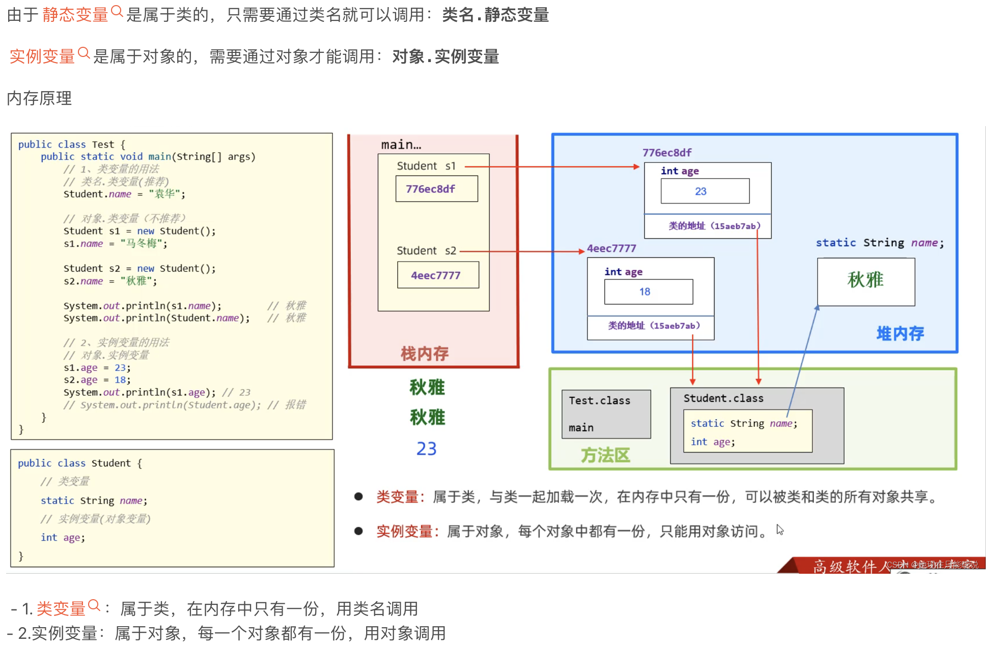
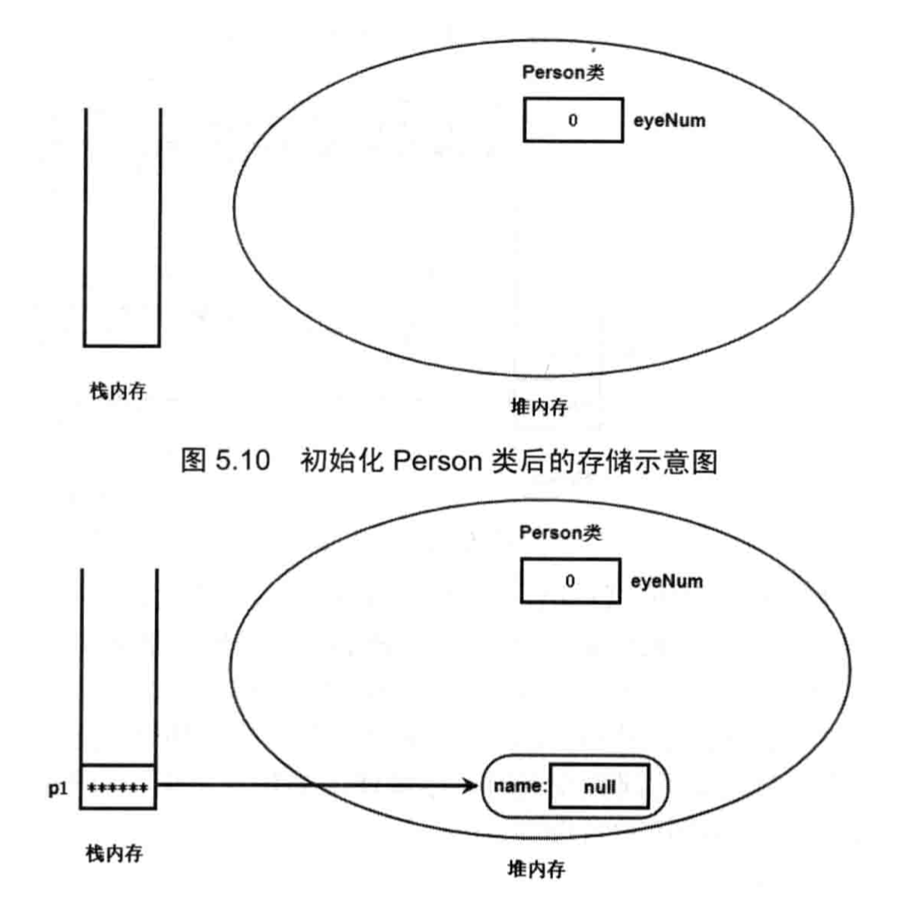

<h1>关于static修饰词以及this关键字的理解</h1>
<h2>关于static</h2>
static修饰符主要是区分1.成员变量2.方法3.内部类4.初始化块是属于这个类本身还是属于实例 <br/>



<h2>关于this</h2>
【个人理解】this以及super只能指类下面的成员，只要是跟static相关的都不能用这两个修饰词（无论是static内部还是外部）<br/>
<br/>
this总是指向调用到该方法的对象。最大的作用是让同一个类的A方法能使用该类中的B方法。<br/>
<br/>
但是不能在static修饰的方法中使用this调用同一个类中的其他方法----首先，static叫静态方法，也叫类方法，它先于任何的对象出现。在程序最开始启动（JVM初始化）的时候，就会为static方法分配一块内存空间，成为静态区，属于这个类。而非static方法，必须在类实例化的时候，才会给分配内存空间，在实例化对象的时候JVM在堆区分配一个具体的对象，this指针指向这个对象。也就是说，this指针是指向堆区中的类的对象，而static域不属于this指向的范围所在，所以不能调用。<br/>



同时，在static修饰的方法中，不能使用super()，道理其实与上面差不多。<br/>
<br/>
super代表子类对父类满参构造函数的初始化，也是需要产生对象才可以使用但是考虑到虚拟机加载顺序为先加载类，当被实例化才产生对象。所以如果并存则表示类和对象同时加载，显然是不合逻辑的。<br/>
<br/>
错误示范

```
public class StaticTest {

    void info(){
        System.out.println("Success");
    }

    public static void main(String[] args){
        this.info();
    }
}
```

结果显示编译不通过----无法从静态上下文中引用非静态 变量 this <br/>
原因是main方法有static修饰，先于info方法加载至内存并执行，但是此时info方法由于没有static修饰，因此还未加载到内存，因此main方法无法获取。应该修改为下面内容

```
public class StaticTest {

    void info(){
        System.out.println("Success");
    }

    public static void main(String[] args){
        // 需要先新建一个类，用这个类去调用static修饰的类方法info
        StaticTest A = new StaticTest();
        A.info();
    }
}
```

显示通过并成功返回结果 Success <br/>
 <br/>
或者改为下面的内容----即增加info的static修饰符，也可以通过编译正常运行 <br/>

```
public class StaticTest {

    // 增加修饰词static
    static void info(){
        System.out.println("Success");
    }

    public static void main(String[] args){
        info();
    }
}
```

原理为，info增加static修饰词后，相比不加static会在整体代码运行前先行加载到内存中，因此可以成功执行。<br/>


<h2>单例类</h2>
通过static实现的单例类是一种设计模式，它确保一个类只有一个实例，并提供一个全局访问点来获取该实例。单例模式在很多场景中都很有用，例如配置信息的读取、数据库连接池、线程池等。 <br/>
1.饿汉式（Eager Initialization预加载模式）

```
public class Singleton {  
    // 在类加载时就完成了初始化，所以类加载较慢，但获取对象的速度快  
    private static Singleton instance = new Singleton();  
  
    private Singleton() {}  
  
    public static Singleton getInstance() {  
        return instance;  
    }  
}
```

2.懒汉式（Lazy Initialization懒加载模式）

```
public class Singleton {  
    // 延迟初始化，类加载快，但第一次获取对象时较慢  
    private static Singleton instance;  
  
    private Singleton() {}  
  
    public static Singleton getInstance() {  
        if (instance == null) {  
            instance = new Singleton();  
        }  
        return instance;  
    }  
}

3.其他类型略
